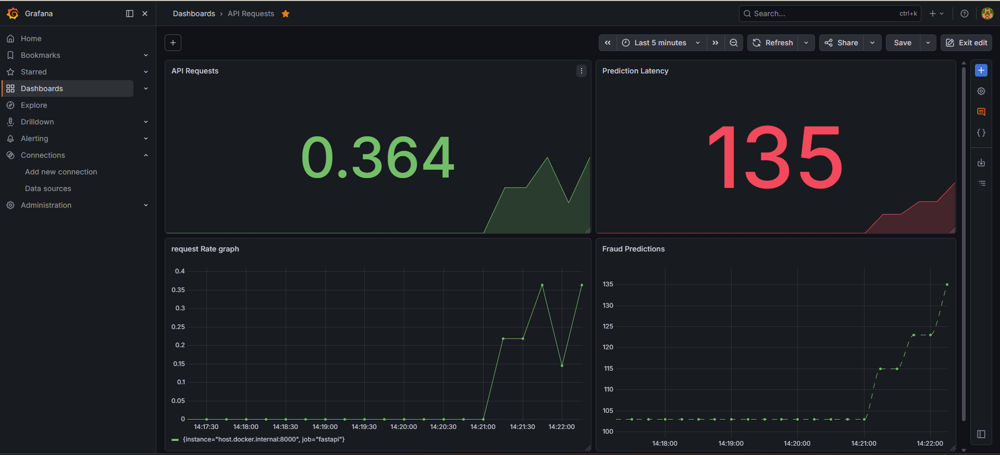
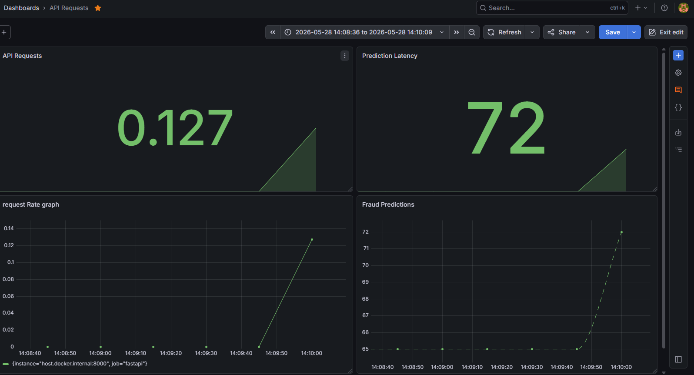

# Real-Time Fraud Detection Feature Store

A production-style Real-Time Machine Learning Feature Store for Fraud Detection built using Kafka, Redis, PostgreSQL, FastAPI, Prometheus, and Grafana.

This project simulates live credit card transaction streams, performs real-time feature engineering, stores online/offline features, serves fraud predictions via APIs, and visualizes system metrics through Grafana dashboards.

---

# System Architecture

```text
Producer
   ↓
Kafka
   ↓
Consumer
   ↓
Real-Time Feature Engineering
   ↓
 ┌──────────────┐
 ↓              ↓
Redis        PostgreSQL
(Online)     (Offline)
   ↓
FastAPI Inference API
   ↓
Prometheus Metrics
   ↓
Grafana Dashboard
```

---

# Features

* Real-time transaction streaming using Kafka
* User-level rolling window feature engineering
* Redis Online Feature Store
* PostgreSQL Offline Feature Store
* Real-time fraud prediction API using FastAPI
* XGBoost fraud detection model
* Prometheus metrics integration
* Grafana monitoring dashboards
* Dockerized infrastructure
* Persistent Docker volumes for Grafana/PostgreSQL/Prometheus

---

# Tech Stack

| Category              | Technologies                     |
| --------------------- | -------------------------------- |
| Streaming             | Apache Kafka                     |
| Backend               | Python, FastAPI                  |
| Feature Engineering   | Python                           |
| Online Feature Store  | Redis                            |
| Offline Feature Store | PostgreSQL                       |
| Machine Learning      | XGBoost, Scikit-learn            |
| Monitoring            | Prometheus, Grafana              |
| Containerization      | Docker, Docker Compose           |
| Data Processing       | Pandas, NumPy                    |
| Dataset               | Kaggle Credit Card Fraud Dataset |

---

# Dataset

Dataset Used:

Credit Card Fraud Detection Dataset

Contains:

* 284,807 transactions
* 492 fraud cases
* Highly imbalanced fraud detection dataset

Features:

* V1-V28 → PCA anonymized features
* Time
* Amount
* Class → Fraud Label

Dataset Link:

https://www.kaggle.com/datasets/mlg-ulb/creditcardfraud

---

# Project Structure

```text
FeatureStore/
│
├── producer.py
├── consumer.py
├── app.py
├── train_model.py
├── setup_postgres.py
├── fraud_model.pkl
├── docker-compose.yml
├── prometheus.yml
├── creditcard.csv
│
├── screenshots/
│   ├── grafana-dashboard.png
│   ├── api-response.png
│
└── README.md
```

---

# How The System Works

## 1. Producer

`producer.py` reads transactions from the dataset and streams them into Kafka in real-time.

Responsibilities:

* Simulates live transaction streams
* Adds synthetic user IDs
* Pushes events into Kafka

---

## 2. Kafka

Kafka acts as the streaming message broker.

Responsibilities:

* Buffers transactions
* Handles real-time event streaming
* Decouples producer and consumer

---

## 3. Consumer

`consumer.py` consumes Kafka events and performs feature engineering.

Features Computed:

* Rolling Average Amount
* Maximum Recent Amount
* Transaction Count
* Spike Ratio
* Time Gap Between Transactions

Responsibilities:

* Real-time feature engineering
* User-level rolling windows
* Store online features in Redis
* Store offline features in PostgreSQL

---

## 4. Redis (Online Feature Store)

Stores the latest user features for low-latency inference.

Example Redis Record:

```text
user:42
{
 amount: 5000
 avg_amount: 850
 spike_ratio: 5.88
 time_gap: 2
}
```

---

## 5. PostgreSQL (Offline Feature Store)

Stores historical features for:

* Model retraining
* Analytics
* Backfills
* Historical auditing

---

## 6. FastAPI

FastAPI serves real-time fraud predictions.

Endpoint:

```text
/predict/{user_id}
```

Example:

```json
{
  "user_id": 1,
  "fraud_probability": 0.6669
}
```

---

## 7. Prometheus

Collects metrics from FastAPI.

Metrics:

* API Requests
* Fraud Predictions
* Prediction Latency

---

## 8. Grafana

Visualizes real-time monitoring dashboards.

Tracks:

* API Requests
* Fraud Predictions
* Prediction Latency
* Request Rates

---

# Setup Instructions

---

# Prerequisites

Install:

* Python 3.10+
* Docker Desktop
* Git

Enable:

* Docker WSL2 Backend

---

# Python Dependencies

Install dependencies:

```bash
pip install pandas numpy scikit-learn xgboost fastapi uvicorn kafka-python redis psycopg2-binary sqlalchemy prometheus-client joblib
```

---

# Start Infrastructure

Open terminal in project directory:

```bash
docker compose up -d
```

This starts:

* Kafka
* Redis
* PostgreSQL
* Prometheus
* Grafana

---

# Verify Containers

```bash
docker ps
```

Expected containers:

* kafka
* redis
* postgres
* prometheus
* grafana

---

# Create PostgreSQL Table

Run once:

```bash
python setup_postgres.py
```

---

# Train Model

Run once:

```bash
python train_model.py
```

This generates:

```text
fraud_model.pkl
```

---

# Start Consumer

Open a new terminal:

```bash
python consumer.py
```

---

# Start Producer

Open another terminal:

```bash
python producer.py
```

---

# Start FastAPI

Open another terminal:

```bash
uvicorn app:app --reload
```

---

# Access FastAPI

Swagger Docs:

```text
http://127.0.0.1:8000/docs
```

Prediction API:

```text
http://127.0.0.1:8000/predict/1
```

---

# Access Prometheus

```text
http://localhost:9090
```

---

# Access Grafana

```text
http://localhost:3000
```

Default Credentials:

| Username | Password |
| -------- | -------- |
| admin    | admin    |

---

# Grafana Dashboard Setup

## Add Prometheus Data Source

Connections → Data Sources → Add Data Source → Prometheus

Set URL:

```text
http://prometheus:9090
```

---

# Suggested Queries

## API Requests

```promql
api_requests_total
```

---

## Fraud Predictions

```promql
fraud_predictions_total
```

---

## Prediction Latency

```promql
prediction_latency_seconds_sum
```

---

## Request Rate

```promql
rate(api_requests_total[1m])
```

---

# Auto Refresh Recommendation

Set Grafana refresh interval:

```text
5s
```

---

# How To Stop Everything

---

# Stop Producer

Close terminal or press:

```text
CTRL + C
```

---

# Stop Consumer

Close terminal or press:

```text
CTRL + C
```

---

# Stop FastAPI

Close terminal or press:

```text
CTRL + C
```

---

# Stop Docker Infrastructure

```bash
docker compose down
```

---

# IMPORTANT

Do NOT use:

```bash
docker compose down -v
```

unless you want to delete:

* Grafana dashboards
* PostgreSQL data
* Prometheus history

---

# Persistent Docker Volumes

The project uses persistent volumes for:

* PostgreSQL
* Prometheus
* Grafana

This ensures:

* dashboards survive restarts
* metrics remain stored
* database persists

---

# Screenshots

Create a folder:

```text
screenshots/
```

Add:

* Grafana Dashboard screenshots
* FastAPI response screenshots
* Swagger UI screenshots

---

# Example README Image Usage

### Grafana Dashboard



---


```

#

---

#

---

#

---
